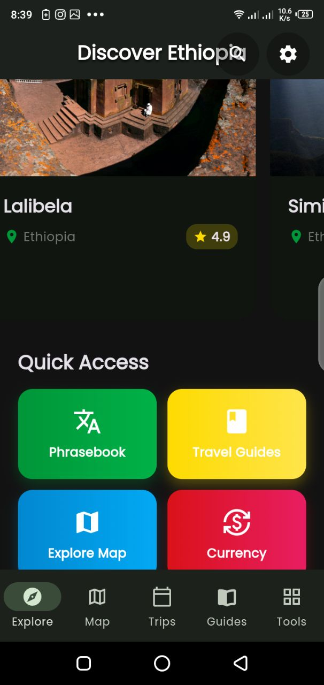
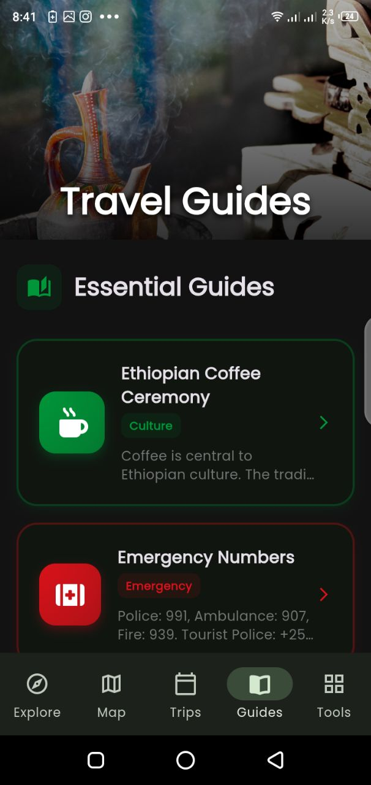
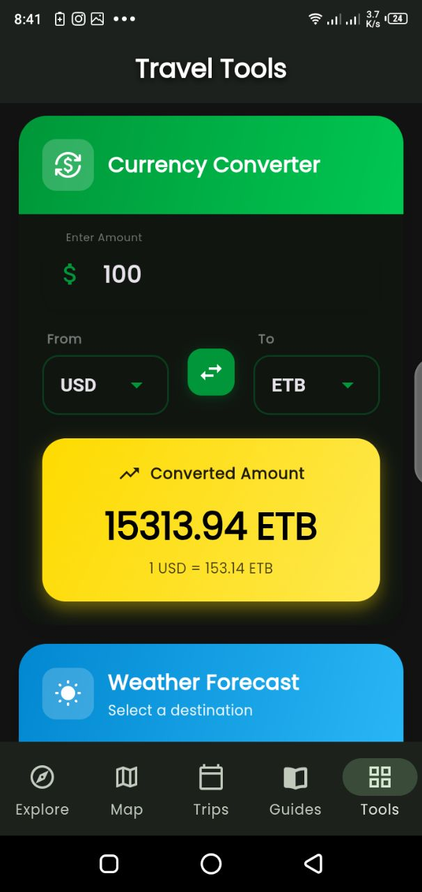
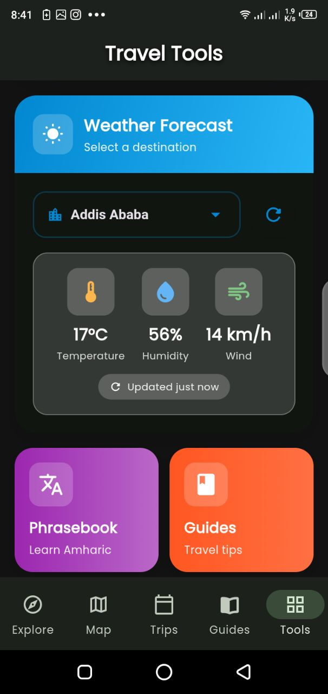

<<<<<<< HEAD
# ProExplore — Discover Ethiopia

ProExplore is a beautifully designed **Ethiopian tourism guide app** built with Flutter. It helps tourists and travelers explore Ethiopia’s natural wonders, historical sites, cultural destinations, and adventure spots with ease.

The app includes **interactive maps**, **weather integration**, and **detailed place descriptions** to assist both local and international tourists.

---

---

## Screenshots


<table>
  <tr>
    <td></td>
    <td></td>
    <td></td>
    <td></td>
  </tr>
  <tr>
    <td></td>
    <td></td>
    <td></td>
    <<td></td>
  </tr>
</table>

---
=======
# ProTravel 🌍

**Your Ultimate Offline Travel Companion**

ProTravel is a comprehensive mobile application designed to empower travelers with essential tools and information, ensuring a seamless experience even without an active internet connection. From itinerary planning to navigating foreign streets and bridging language gaps, ProTravel is the only travel buddy you'll ever need.

---

## ✨ Key Features

-   **📍 Smart Trip Planner**: Organize your journeys with ease. Create custom itineraries, add destinations, and manage your travel dates in one place.
-   **🗺️ Interactive Offline Maps**: Never get lost again. Access high-quality map data and navigate destinations offline.
-   **🗣️ Language Phrasebook**: Communicate like a local. Access a curated list of essential phrases categorized for various travel situations.
-   **🎒 Destination Guides**: Discover top attractions, local secrets, and expert tips for your next adventure.
-   **🛠️ Essential Travel Tools**:
    -   **Currency Converter**: Quick and accurate real-time (when online) and cached (when offline) currency calculations.
    -   **Weather Updates**: Stay prepared with current weather conditions for your destinations.
    -   **Location Services**: Integrated location tracking to help you find your way.

---

## 🚀 Tech Stack

-   **Core Framework**: [Flutter](https://flutter.dev/) - For building beautiful, natively compiled applications.
-   **State Management**: [Provider](https://pub.dev/packages/provider) - A wrapper around InheritedWidget to make state management easier.
-   **Navigation**: [GoRouter](https://pub.dev/packages/go_router) - A declarative routing package for Flutter.
-   **Local Storage**: [Hive](https://docs.hivedb.dev/) - A lightweight and blazing fast key-value database written in pure Dart.
-   **Maps & Geospatial**:
    -   [Flutter Map](https://pub.dev/packages/flutter_map) - A versatile mapping widget for Flutter.
    -   [LatLong2](https://pub.dev/packages/latlong2) - Lightweight library for latitude and longitude calculations.
-   **UI & Experience**:
    -   [Google Fonts](https://pub.dev/packages/google_fonts) - Access to hundreds of beautiful fonts.
    -   [Font Awesome](https://pub.dev/packages/font_awesome_flutter) - For a wide range of vector icons.
    -   [FL Chart](https://pub.dev/packages/fl_chart) - For beautiful data visualizations.
    -   [Cached Network Image](https://pub.dev/packages/cached_network_image) - For efficient image loading and caching.
-   **Utilities**:
    -   `intl`: For internationalization and date/number formatting.
    -   `uuid`: For generating unique identifiers (trips, items).
    -   `path_provider`: For finding commonly used locations on the filesystem.
    -   `url_launcher`: For opening URLs, emails, and phone calls.
    -   `http`: For making network requests.

---

## 🛠️ Development Tools

-   **[Build Runner](https://pub.dev/packages/build_runner)**: Used for generating Hive TypeAdapters.
-   **[Flutter Launcher Icons](https://pub.dev/packages/flutter_launcher_icons)**: To simplify the process of updating app icons across platforms.

---

## 🏁 Getting Started

### Prerequisites

-   Flutter SDK: `>=3.2.0 <4.0.0`
-   Dart SDK

### Installation

1.  **Clone the repository**:
    ```bash
    git clone https://github.com/your-username/protravel.git
    cd protravel
    ```

2.  **Install dependencies**:
    ```bash
    flutter pub get
    ```

3.  **Generate data models**:
    ```bash
    flutter pub run build_runner build --delete-conflicting-outputs
    ```

4.  **Run the application**:
    ```bash
    flutter run
    ```

---

## 📄 License

This project is licensed under the MIT License - see the [LICENSE](LICENSE) file for details.
>>>>>>> 68123c3 (add readme.md file)
